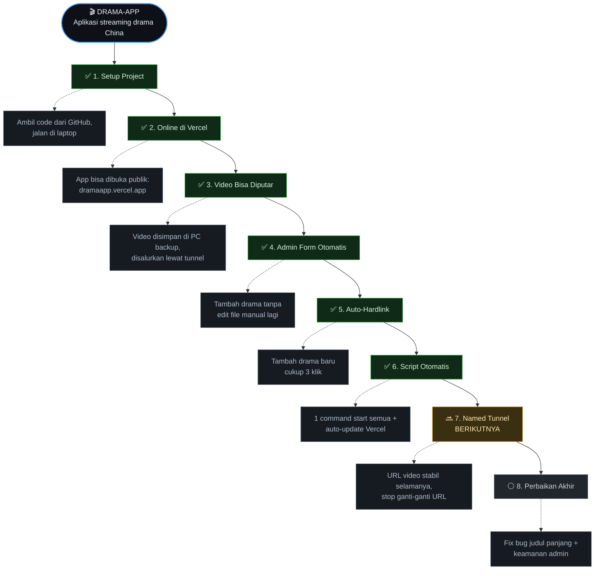

# 🗺️ Plan Mapping — Drama-App / DramaKu

> Peta perjalanan project dari awal sampai sekarang + rencana berikutnya.
> App live: https://dramaapp.vercel.app/
>
> **Cara lihat diagram:** buka file ini di GitHub (web) atau VS Code Preview — diagram di bawah otomatis jadi peta node/flowchart.

---

## 📊 Peta Alur

**Keterangan warna:** 🟢 Selesai · 🟡 Dikerjakan berikutnya · ⚪ Rencana nanti
Kotak garis putus-putus = cabang/hasil dari tiap tahap.

---

## 📋 Penjelasan Singkat

### ✅ SUDAH SELESAI

| Tahap | Hasilnya |
|---|---|
| **1. Setup Project** | Code drama-app diambil dari GitHub, dijalankan di laptop. |
| **2. Online di Vercel** | App bisa dibuka siapa saja: `dramaapp.vercel.app`. |
| **3. Video Bisa Diputar** | Video disimpan di PC backup, disalurkan ke app lewat tunnel. |
| **4. Admin Form Otomatis** | Tambah drama lewat form — tidak perlu edit file manual. |
| **5. Auto-Hardlink** | Tambah drama baru cukup 3 klik (~2 menit per drama). |
| **6. Script Otomatis** | Cukup 1 command untuk start semua + auto-update Vercel. |

### 🔜 BERIKUTNYA

**7. Named Tunnel** — Saat ini URL video berubah tiap PC restart. Setelah pakai Named Tunnel, URL video **stabil selamanya** → tidak perlu update Vercel berulang.

### ⚪ RENCANA NANTI

**8. Perbaikan Akhir** — Fix bug judul drama panjang (slug ke-potong) + perkuat keamanan login admin.

---

## 📈 Posisi Sekarang
- **App:** live & jalan normal di `https://dramaapp.vercel.app/`.
- **Selesai:** Tahap 1 sampai 6.
- **Langkah berikutnya:** Tahap 7 — Named Tunnel (biar URL video tidak ganti-ganti lagi).
